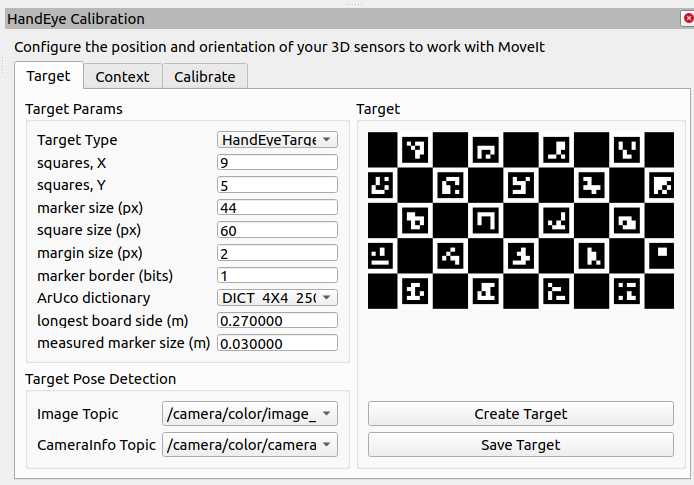
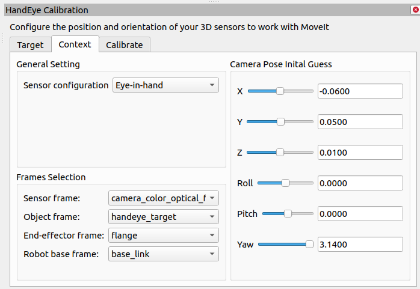
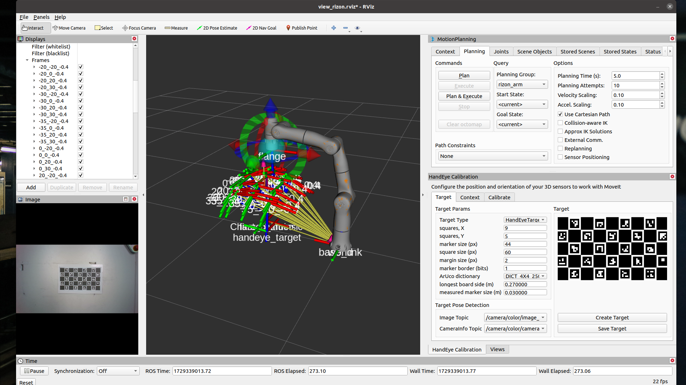
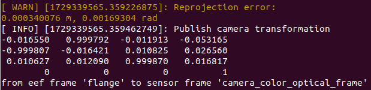

# Flexiv Calibration
This repo is the source code to a auto calibration package that was created to automate the handeye calibration for the bin packing automation project.

Main Project: [Bin Packing Automation](https://github.com/PiusLim373/flexiv_bin_packing/tree/ros2_implementation)

> [!IMPORTANT]
> This repo will only focus on getting the calibration package up and running. For detail usage of Flexiv ROS Driver, please visit the original [Flexiv ROS](https://github.com/flexivrobotics/flexiv_ros) Repo.


 The project is a collaboration project between Flexiv and NUS MSc in Robotics ME5400A and ME5400B module.

## Setup
### 1. Create workspace and clone necessary dependencies
```
mkdir -p ~/catkin_ws/src
cd ~/catkin_ws/src

# clone this forked repo
git clone https://github.com/PiusLim373/flexiv_ros

# clone the moveit-calibration package
git clone git@github.com:moveit/moveit_calibration.git
```

### 2. Build and Source the Environment
```
cd ~/catkin_ws
catkin_make

source devel/setup.bash
```

## Running the Handeye Calibration
### 1. Starting the hardwares driver
```
# Starting the Realsense Camera driver
roslaunch realsense2_camera rs_camera.launch

# Starting the Rizon 4s ROS driver and moveit commander
# Change the robot type, robot ip and local ip based on your setup, 
# use_rviz is set to false as we have a custom rviz config file
roslaunch flexiv_moveit_config moveit_control.launch robot_ip:=192.168.3.100 local_ip:=192.168.3.101 rizon_type:=rizon4s use_rviz:=false use_rviz:=false
```

### 2. Starting the calibration software
This will launch a vision service that reads camera stream and output ChArUco pose, and the main calibration functions
```
roslaunch flexiv_calibration calib.launch
```

### 3. Start the RVIZ Visualizer
```
rviz -d $(roscd flexiv_calibration; pwd)/config/calib.rviz
```

### 4. Prepare calibration board
Print the `calibration_board.pdf` at actual size and place it somewhere where the camera can see it. The board should stay stationary throughout the calibration process.  

### 5. Setting up moveit calibration RVIZ GUI
The default value is saved and should be loaded along when RVIZ is launch using the previous command, but if this isnt loaded or changes is needed, you can adjust from the calibration GUI itself.




:warning: It is important to set the `Target` and `Context` tabs corectly. The camera pose initial guess may comes from the mount CAD value.

### 6. Run the calibration
To perform auto calibration, calibration pose needs to be generated first.
```
rosservice call /generate_calib_pose "{}"
```
A list of calibration poses will be generated, these poses are generated in a sphere profile, using the ChArUco pose detected as centriod. The profile can be futher tuned in `calib_pose_sender.py`.




This will also save a `calibration_pose.txt` in the directory supplied in the launch file, for future usage.

After calibration poses is generated, the following service is called to send the robot to the generated poses. The robot will pause at each pose, press the `Take Sample` button from the RVIZ calibration GUI and press `enter` to send the robot to the next pose. 
```
rosservice call /start_calibration "starting_index: 0"
```
Even if the calibration is interrupted, as long as the RVIZ node is kept alive, the calibration process will not be lost. The `starting_index` service parameter is used to skip forward to a specific calibration pose.

### 7. Done calibration
It is recommended to take 20+ samples for the calibration to converge and accurate, using the `Solve` button will generate a 4x4 transformation matrix that represent the tf between flange and color_optical_frame. This matrix is then input to the `camera_tf_handler` in [Bin Packing Automation](https://github.com/PiusLim373/flexiv_bin_packing/tree/ros2_implementation).


